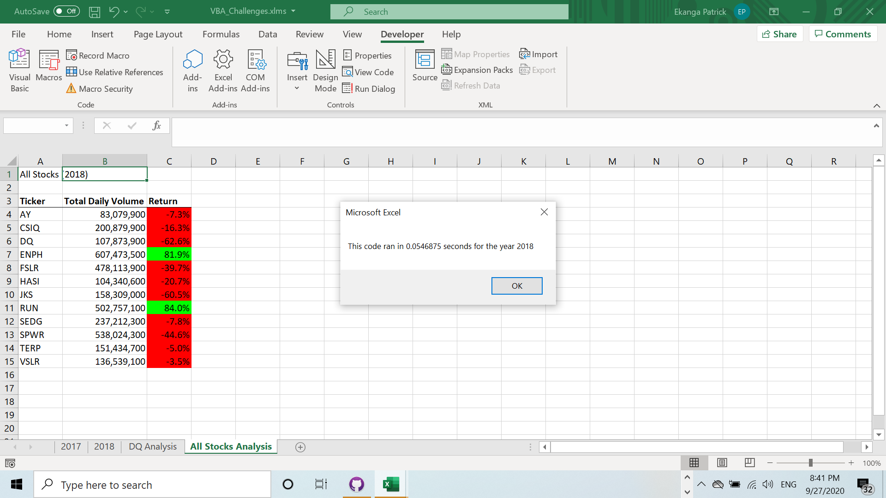

# Stock-Analysis

## Overview of Project

The project is about supporting Steve in making a proper assessment on the stock performance. He is mainly looking to find the total daily volume and yearly return for each stock under the portfolio.

Upon our analysis, Steve will be able to draw conclusion and advise on the most profitable investment over time.

### Results

* Initial Execution Time

As per the screen shot below, the code run very fast without refactoring, from my side. This is becaue while tryign to refactor on my own, i couldnt get the correct process.

As per the screen shot above, the time taken in running the code is still faster but load slowly before refactoring.

* Refactored Execution Time

The refactored codes as shown below, in terms of timer is much more faster and below 0.1 seconds compared to the initial execution.

## Summary

1. What are the advantages or disadvantages of refactoring code?
   
   **Advantages**

    - One of the advantage is that it runs faster when refactored. I also understand as per the module and the exercise refactoring makes the code run more "efficient—by taking fewer steps, using less memory, or improving the logic of the code to make it easier for future users to read".

    - Secondly, when you have more experience in coding, it is a useful tool to use codes which are proven to be working and you only add few lines to make it more and more efficient for your own use and the organization and colleagues/ teamamtes.

    **Disadvantages**
    - Difficult to master for layman in coding. The process is cumbersome and require lot of time to master the sequence
    - Removing a code without quoting it is disastrous. So refactoring need to be used carefully until you control the flow, sequnce and why the coding is applied. 
   
2. How do these pros and cons apply to refactoring the original VBA script?

   -   The cons were too many to my original codes. I wanted to understand the flow charts and so i prevent copying litterally the codes from colleagues. However i ended up not successfully concluding it. With time, i will understand and apply successfully the concept.
